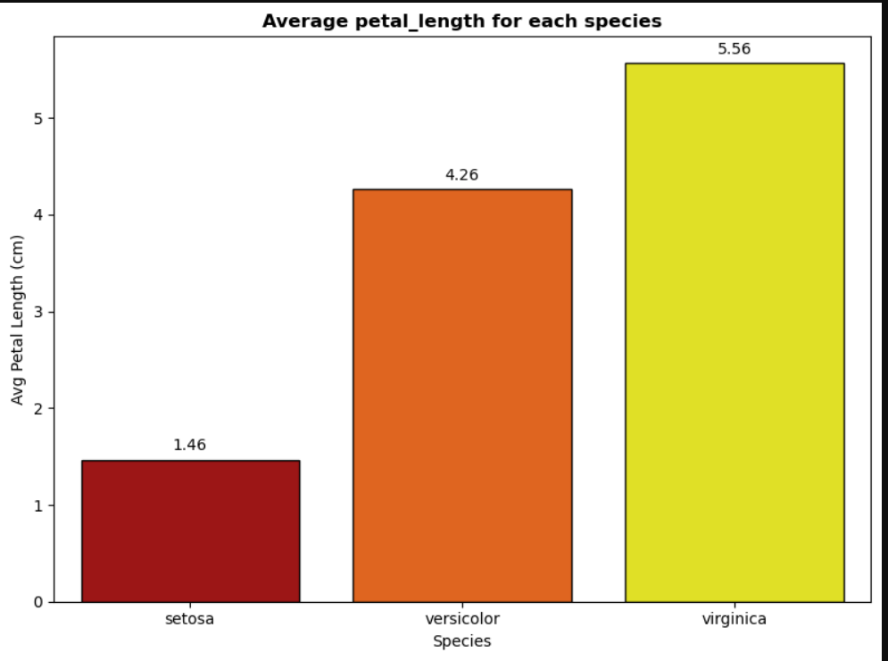
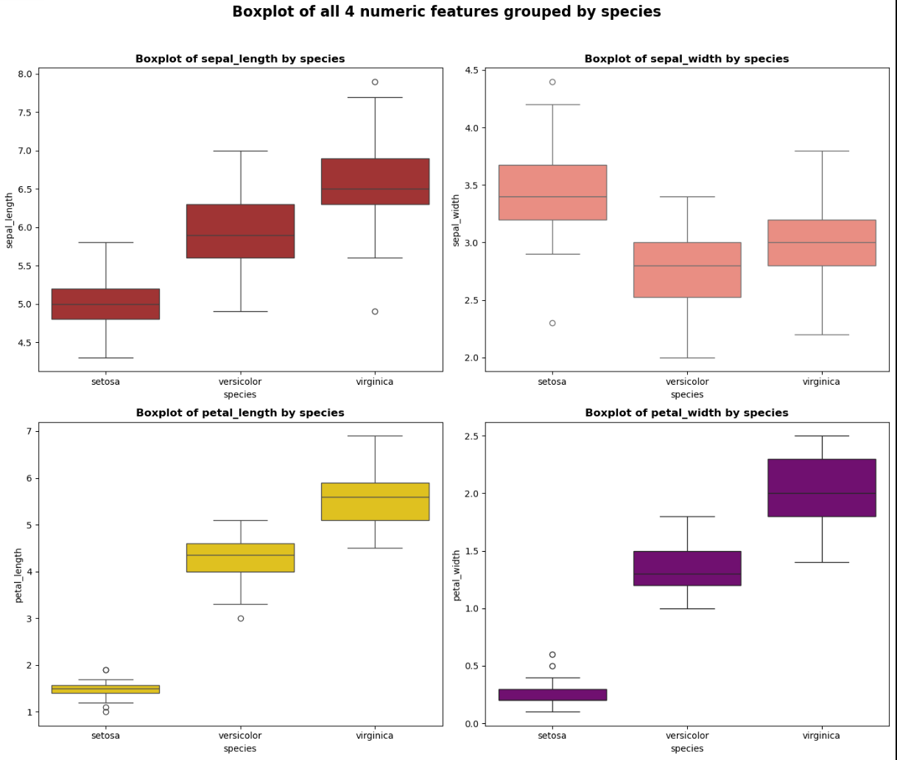
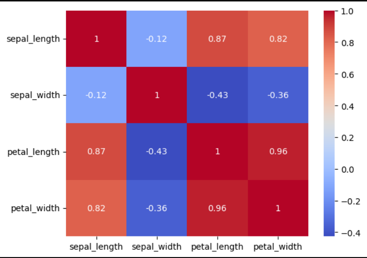
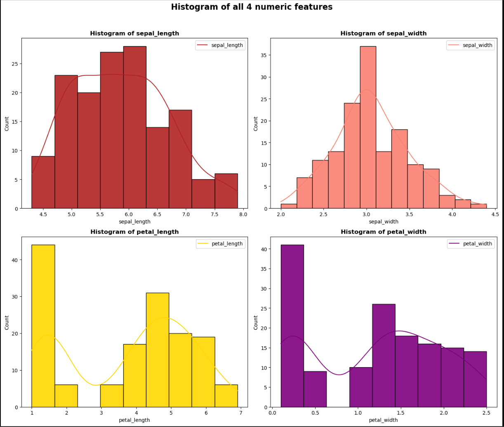
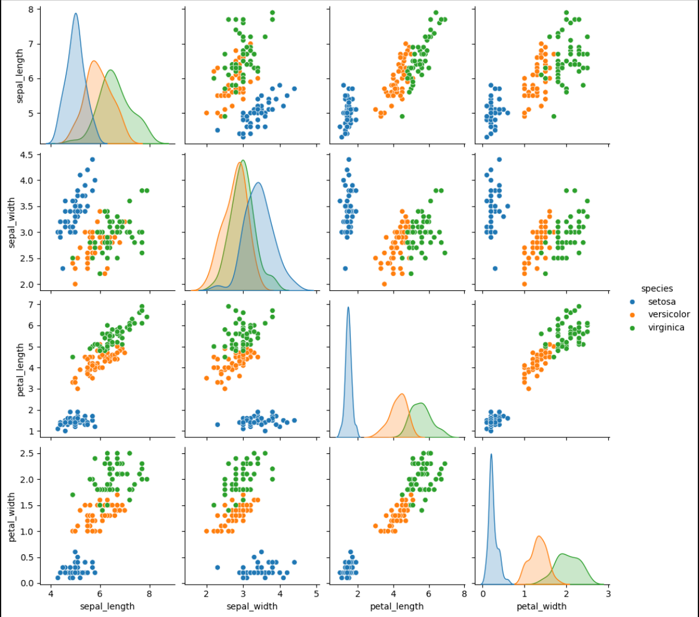
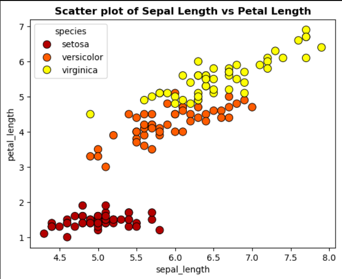

# 🌸 Task 2 — Data Visualization | Iris Dataset


---

## 📌 Objective

Perform end-to-end data analysis on the **Iris Dataset** — covering data cleaning, preprocessing, exploratory data analysis (EDA), and meaningful visualizations to uncover patterns across 3 flower species.

> This task goes beyond the internship requirement of basic charts — a full data science pipeline was implemented for better understanding and learning.

---

## 📂 Dataset

| Property | Details |
|---|---|
| **Dataset** | Iris Dataset |
| **Source** | Built-in Seaborn dataset (`sns.load_dataset('iris')`) |
| **Rows** | 150 (149 after duplicate removal) |
| **Columns** | 5 (4 numeric features + 1 target) |
| **Classes** | 3 species — *setosa*, *versicolor*, *virginica* |
| **No external download required** | Data loads directly via `seaborn` |

### Features

| Column | Type | Description |
|---|---|---|
| `sepal_length` | float64 | Length of the sepal (cm) |
| `sepal_width` | float64 | Width of the sepal (cm) |
| `petal_length` | float64 | Length of the petal (cm) |
| `petal_width` | float64 | Width of the petal (cm) |
| `species` | object | Flower species (target label) |

---

## 🗂️ Project Structure

```
synent-task2-Data-Visualization-vikas/
│
├── Untitled.ipynb       # Main Jupyter notebook (full pipeline)
└── README.md              # Project documentation
```

---

## 🔬 What's Covered

### Phase 0 — Project Setup & Basic Information
- Loaded dataset using `seaborn.load_dataset('iris')`
- Inspected shape, column names, data types
- Printed statistical summary using `.describe()`
- Checked unique values and value counts for all columns

### Phase 1 — Data Cleaning
- Checked for **null values** → 0 missing values found
- Detected and removed **1 duplicate row** (row 142) → shape updated to 149 rows
- Detected **outliers** using the **IQR method** → 4 outliers found in `sepal_width`

### Phase 2 — Preprocessing
- Applied **Label Encoding** on `species` column → added `species_encoded` (0, 1, 2)
- Applied **StandardScaler** on all 4 numeric features → created `df_scaled`
- Printed side-by-side comparison of original vs scaled values

### Phase 3 — Exploratory Data Analysis (EDA)
- Grouped mean of each feature **by species** → *virginica* has the highest average petal length (5.56)
- Computed **correlation matrix** → `petal_length` & `petal_width` are most correlated (r = 0.96)
- Calculated **variance** per feature → `petal_length` has the highest variance (3.13)
- Found **min and max** of `petal_width` grouped by species

### Phase 4 — Visualizations
| Chart | Description |
|---|---|
| 📊 **Bar Chart** | Average `petal_length` per species with value labels |
| 📈 **Histogram (2×2)** | Distribution of all 4 features in a single figure |
| 🔵 **Scatter Plot** | `sepal_length` vs `petal_length` colored by species |
| 📦 **Boxplot (2×2)** | All 4 features grouped by species — shows clear separation |
| 🌡️ **Heatmap** | Correlation matrix with annotated values |
| 🔷 **Pairplot** | All feature relationships colored by species |

---

## 💡 Key Findings

- **Setosa** is clearly separable from the other two species — visible in scatter plots and boxplots
- **`petal_length` and `petal_width`** are the most correlated features (r = **0.96**)
- **`petal_length`** has the highest variance (3.13) — most useful feature for distinguishing species
- **Virginica** has the largest petal dimensions on average
- **Sepal width** had 4 outliers detected via IQR — all belong to setosa species

---

## 🛠️ Libraries Used

```python
import numpy as np
import pandas as pd
import seaborn as sns
import matplotlib.pyplot as plt
from sklearn.preprocessing import LabelEncoder, StandardScaler
```

---

## 📸 Screenshots 







---

## 📊 Sample Visualizations

> Run the notebook to see all 6 charts rendered with outputs.

---

## 👤 Author

**Vikas**  
Data Science Project — 2026

---

